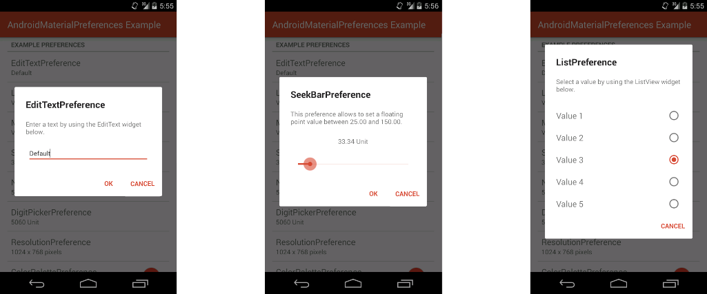
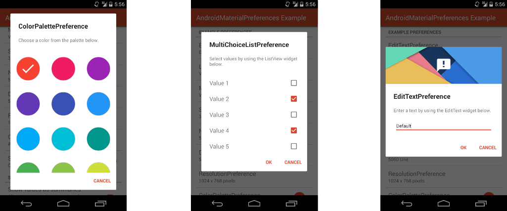

# AndroidMaterialPreferences - README

"AndroidMaterialPreferences" is an Android-library, which provides various preferences, which are designed according to Android 5's Material Design guidelines even on pre-Lollipop devices.






The library provides the following preferences:

- A preference, which allows to enter a text via an `EditText` widget (`EditTextPreference`).
- A preference, which allows to select a value from a list (`ListPreference`).
- A preference, which allows to select multiple values from a list (`MultiChoiceListPreference`).
- A preference, which allows to choose a floating point value or an integer value from a continuous range via a `SeekBar` widget (`SeekBarPreference`).
- A preference, which allows to choose a decimal value using a `NumberPicker` widget (`NumberPickerPreference`).
- A preference, which allows to choose a decimal value, consisting of individual digits of which each can be chosen using a `NumberPicker` widget (`DigitPickerPreference`).
- A preference, which allows to choose an image or video resolution via two `EditText` widgets (`ResolutionPreference`).
- A preference, which allows to choose a color from a predefined color palette (`ColorPalettePreference`).
- A preference, which provides a toggleable option using a `Switch` widget (`SwitchPreference`).

## License Agreement

This project is distributed under the GNU Lesser Public License version 3.0 (GLPLv3). For further information about this license agreement's content please refer to its full version, which is available at http://www.gnu.org/licenses/lgpl.txt.

## Download

The latest release of this library can be downloaded as a zip archive from the download section of the project's Github page, which is available [here](https://github.com/michael-rapp/AndroidMaterialPreferences/releases). Furthermore, the library's source code is available as a Git repository, which can be cloned using the URL https://github.com/michael-rapp/AndroidMaterialPreferences.git.

Alternatively, the library can be added to your Android app as a Gradle dependency by adding the following to the respective module's `build.gradle` file:

```
dependencies {
    compile 'com.github.michael-rapp:android-material-preferences:2.0.4'
}
```

Before version 2.0.0 this project was hosted on [Sourceforge](https://sourceforge.net/projects/androidmaterialpreferences). These older versions used the legacy Eclipse ADT folder structure and are not available as Gradle artifacts.

## Examples

The following examples provide a quick overview on how to use the preferences, which are provided by the library, in your own Android app. This project also contains the source code of an example app, which implements an use case of the library for demonstration purposes, as well as a more detailed documentation and auto-generated javadoc files.

### SeekBarPreference

The XML code below shows how to declare a `SeekBarPreference` as part of a `PreferenceScreen`. The example contains all of the preference's custom attributes.

```
<?xml version="1.0" encoding="utf-8"?> 
<PreferenceScreen xmlns:android="http://schemas.android.com/apk/res/android" 
    xmlns:custom="http://schemas.android.com/apk/res-auto" >

    <de.mrapp.android.preference.SeekBarPreference 
        android:defaultValue="33.336" 
        android:dialogTitleColor="@android:color/black" 
        android:dialogMessageColor="@android:color/black" 
        android:dialogButtonTextColor="@android:color/black" 
        android:dialogBackground="@android:color/white" 
        android:dialogMessage="@string/seek_bar_preference_dialog_message" 
        android:dialogTitle="@string/seek_bar_preference_dialog_title" 
        android:key="@string/seek_bar_preference_key" 
        android:max="150" 
        android:summary="@array/seek_bar_preference_summaries" 
        android:title="@string/seek_bar_preference_title" 
        custom:decimals="2" 
        custom:floatingPointSeparator="." 
        custom:min="25" 
        custom:showProgress="true" 
        custom:showValueAsSummary="false" 
        custom:unit="Unit" /> 

</PreferenceScreen>
```

### EditTextPreference

The example below shows how the attributes of an `EditTextPreference` can be specified within a XML resource.

```
<?xml version="1.0" encoding="utf-8"?> 
<PreferenceScreen xmlns:android="http://schemas.android.com/apk/res/android" 
    xmlns:custom="http://schemas.android.com/apk/res-auto" >

    <de.mrapp.android.preference.EditTextPreference 
        android:defaultValue="DefaultText" 
        android:dialogTitleColor="@android:color/black" 
        android:dialogMessageColor="@android:color/black" 
        android:dialogButtonTextColor="@android:color/black" 
        android:dialogBackground="@android:color/white" 
        android:dialogMessage="@string/edit_text_preference_dialog_message" 
        android:dialogTitle="@string/edit_text_preference_dialog_title" 
        android:key="@string/edit_text_preference_key" 
        android:summary="@string/edit_text_preference_summary" 
        android:title="@string/edit_text_preference_title" 
        custom:showValueAsSummary="false" /> 

</PreferenceScreen>
```

### ListPreference

The example illustrates how the attributes of a `ListPreference` can be specified, if the preference should be declared within a XML resource.

```
<?xml version="1.0" encoding="utf-8"?> 
<PreferenceScreen xmlns:android="http://schemas.android.com/apk/res/android" 
    xmlns:custom="http://schemas.android.com/apk/res-auto" >

    <de.mrapp.android.preference.ListPreference 
        android:defaultValue=0 
        android:entries="R.array.list_preference_entries" 
        android:entryValues="R.array.list_preference_entry_values" 
        android:dialogTitleColor="@android:color/black" 
        android:dialogMessageColor="@android:color/black" 
        android:dialogButtonTextColor="@android:color/black" 
        android:dialogBackground="@android:color/white" 
        android:dialogItemColor="@android:color/black" 
        android:dialogItemControlColor="@android:color/black" 
        android:dialogMessage="@string/list_preference_dialog_message" 
        android:dialogTitle="@string/list_preference_dialog_title" 
        android:key="@string/list_preference_key" 
        android:summary="@array/list_preference_summary" 
        android:title="@string/list_preference_title" 
        custom:showValueAsSummary="false" /> 

</PreferenceScreen>
```

### MultiChoiceListPreference

The following XML code shows how the attributes of a `MultiChoiceListPreference` can be specified, if the preference should be declared within a XML resource.

```
<?xml version="1.0" encoding="utf-8"?> 
<PreferenceScreen xmlns:android="http://schemas.android.com/apk/res/android" 
    xmlns:custom="http://schemas.android.com/apk/res-auto" >

    <de.mrapp.android.preference.MultiChoiceListPreference 
        android:defaultValue="R.array.multi_choice_list_preference_entry_values" 
        android:entries="R.array.multi_choice_list_preference_entries" 
        android:entryValues="R.array.multi_choice_list_preference_entry_values" 
        android:dialogTitleColor="@android:color/black" 
        android:dialogMessageColor="@android:color/black" 
        android:dialogButtonTextColor="@android:color/black" 
        android:dialogBackground="@android:color/white" 
        android:dialogItemColor="@android:color/black" 
        android:dialogItemControlColor="@android:color/black" 
        android:dialogMessage="@string/multi_choice_list_preference_dialog_message" 
        android:dialogTitle="@string/multi_choice_list_preference_dialog_title" 
        android:key="@string/multi_choice_list_preference_key" 
        android:summary="@array/multi_choice_list_preference_summary" 
        android:title="@string/multi_choice_list_preference_title" 
        custom:showValueAsSummary="false" /> 

</PreferenceScreen>
```

### NumberPickerPreference

The following example illustrates how of a `NumberPickerPreference` can be specified via XML for use within a `PreferenceScreen`.

```
<?xml version="1.0" encoding="utf-8"?> 
<PreferenceScreen xmlns:android="http://schemas.android.com/apk/res/android" 
    xmlns:custom="http://schemas.android.com/apk/res-auto" >

    <de.mrapp.android.preference.NumberPickerPreference 
        android:defaultValue="25" 
        custom:min="0" 
        android:max="100" 
        custom:useInputMethod="true" 
        custom:wrapSelectorWheel="false" 
        android:dialogTitleColor="@android:color/black" 
        android:dialogMessageColor="@android:color/black" 
        android:dialogButtonTextColor="@android:color/black" 
        android:dialogBackground="@android:color/white" 
        android:dialogMessage="@string/number_picker_preference_dialog_message" 
        android:dialogTitle="@string/number_picker_preference_dialog_title" 
        android:key="@string/number_picker_preference_key" 
        android:summary="@array/number_picker_preference_summary" 
        android:title="@string/number_picker_preference_title" 
        custom:unit="Unit" 
        custom:stepSize="5" 
        custom:showValueAsSummary="false" /> 

</PreferenceScreen>
```

### DigitPickerPreference

The following example illustrates how of a `DigitPickerPreference` can be declared within a XML resource.

```
<?xml version="1.0" encoding="utf-8"?> 
<PreferenceScreen xmlns:android="http://schemas.android.com/apk/res/android" 
    xmlns:custom="http://schemas.android.com/apk/res-auto" >

    <de.mrapp.android.preference.DigitPickerPreference 
        android:defaultValue="25" 
        custom:numberOfDigits="2" 
        custom:useInputMethod="true" 
        custom:wrapSelectorWheel="false" 
        android:dialogTitleColor="@android:color/black" 
        android:dialogMessageColor="@android:color/black" 
        android:dialogButtonTextColor="@android:color/black" 
        android:dialogBackground="@android:color/white" 
        android:dialogMessage="@string/digit_picker_preference_dialog_message" 
        android:dialogTitle="@string/digit_picker_preference_dialog_title" 
        android:key="@string/digit_picker_preference_key" 
        android:summary="@array/digit_picker_preference_summary" 
        android:title="@string/digit_picker_preference_title" 
        custom:unit="Unit" 
        custom:showValueAsSummary="false" /> 

</PreferenceScreen>
```

### ResolutionPreference

The following XML code shows how of a `ResolutionPreference` can be declared within a XML resource.

```
<?xml version="1.0" encoding="utf-8"?> 
<PreferenceScreen xmlns:android="http://schemas.android.com/apk/res/android" 
    xmlns:custom="http://schemas.android.com/apk/res-auto" >

    <de.mrapp.android.preference.ResolutionPreference 
        android:defaultValue="1024x768" 
        custom:unit=@string/resolution_preference_unit 
        android:dialogTitleColor="@android:color/black" 
        android:dialogMessageColor="@android:color/black" 
        android:dialogButtonTextColor="@android:color/black" 
        android:dialogBackground="@android:color/white" 
        android:dialogMessage="@string/resolution_preference_dialog_message" 
        android:dialogTitle="@string/resolution_preference_dialog_title" 
        android:key="@string/resolution_preference_key" 
        android:summary="@array/resolution_preference_summary" 
        android:title="@string/resolution_preference_title" 
        custom:showValueAsSummary="false" /> 

</PreferenceScreen>
```

### ColorPalettePreference

The following XML structure illustrates how a `ColorPalettePreference` can be specified within a XML resource file.

```
<?xml version="1.0" encoding="utf-8"?> 
<PreferenceScreen xmlns:android="http://schemas.android.com/apk/res/android" 
    xmlns:custom="http://schemas.android.com/apk/res-auto" >

    <de.mrapp.android.preference.ColorPalettePreference 
        android:defaultValue="@color/red" 
        custom:showPreview="true" 
        custom:previewSize="@dimen/preview_size" 
        custom:previewShape="square" 
        custom:previewBorderWidth="@dimen/preview_border_width" 
        custom:previewBorderColor="@color/preview_border_color" 
        custom:previewBackground="@drawable/preview_background" 
        custom:colorFormat="rgb" 
        custom:dialogPreviewSize="@dimen/dialog_preview_size" 
        custom:dialogPreviewShape="square" 
        custom:dialogPreviewBorderWidth="@dimen/dialog_preview_border_width" 
        custom:dialogPreviewBorderColor="@color/dialog_preview_border_color" 
        custom:dialogPreviewBackground="@drawable/dialog_preview_background" 
        custom:numberOfColumns="2" 
        custom:colorPalette="@array/color_palette" 
        android:dialogTitleColor="@android:color/black" 
        android:dialogMessageColor="@android:color/black" 
        android:dialogButtonTextColor="@android:color/black" 
        android:dialogBackground="@android:color/white" 
        android:dialogMessage="@string/color_palette_preference_dialog_message" 
        android:dialogTitle="@string/color_palette_preference_dialog_title" 
        android:key="@string/color_palette_preference_key" 
        android:summary="@array/color_palette_preference_summary" 
        android:title="@string/color_palette_preference_title" 
        custom:showValueAsSummary="false" /> 

</PreferenceScreen>
```
### SwitchPreference

The following XML code shows how a `SwitchPreference` can be declared within a XML resource.

```
<?xml version="1.0" encoding="utf-8"?> 
<PreferenceScreen xmlns:android="http://schemas.android.com/apk/res/android" 
    xmlns:custom="http://schemas.android.com/apk/res-auto" >

    <de.mrapp.android.preference.SwitchPreference 
        android:defaultValue="true" 
        android:summaryOn=@string/summary_on 
        android:summaryOff=@string/summary_off 
        android:disableDependentsState=true 
        android:switchTextOn=@string/switch_text_on 
        android:switchTextOff=@string/switch_text_off 
        android:dialogTitleColor="@android:color/black" 
        android:dialogMessageColor="@android:color/black" 
        android:dialogButtonTextColor="@android:color/black" 
        android:dialogBackground="@android:color/white" 
        android:dialogMessage="@string/switch_preference_dialog_message" 
        android:dialogTitle="@string/switch_preference_dialog_title" 
        android:key="@string/switch_preference_key" 
        android:summary="@array/switch_preference_summary" 
        android:title="@string/switch_preference_title" 
        custom:showValueAsSummary="false" /> 

</PreferenceScreen>
```

## Contact information

For personal feedback or questions feel free to contact me via the mail address, which is mentioned on my [Github profile](https://github.com/michael-rapp). If you have found any bugs or want to post a feature request please use the [bugtracker](https://github.com/michael-rapp/AndroidMaterialPreferences/issues) to report them.